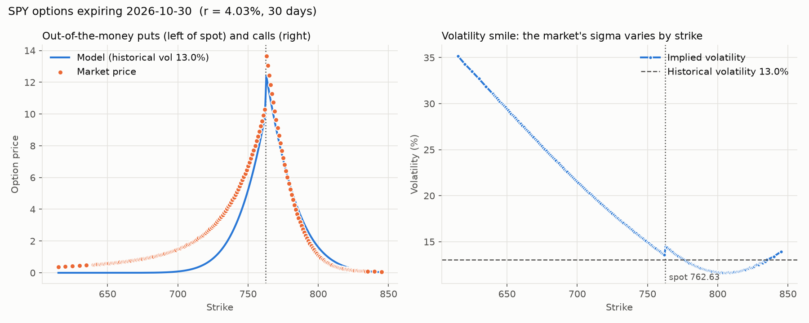
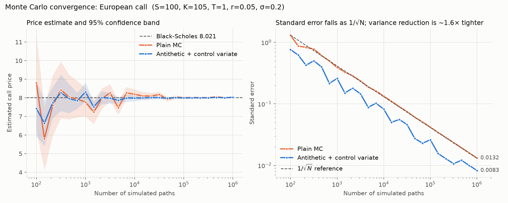
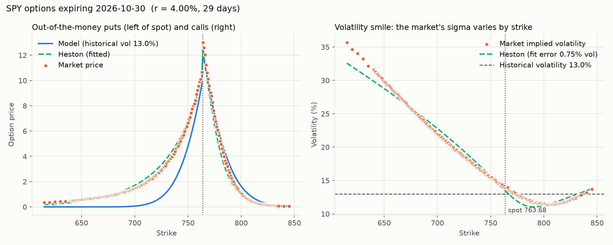

# Monte-Carlo-Option-Model

Price options by simulating many possible stock price paths and averaging the discounted payoff,
then test the model against exact formulas and live market prices.



*Live SPY options, 30 Sep 2026. Left: the model (13% historical volatility) against market prices.
Right: the implied volatility of each strike climbs from about 14% at the money to 35% for puts 20% below
spot. The market pays heavily for crash protection that the lognormal model says is almost worthless.*

## Features

- **European and Asian options** by Monte Carlo under geometric Brownian motion, checked against Black-Scholes
- **Variance reduction** with antithetic variates and a control variate
- **Greeks** (delta, gamma, vega) by bump-and-reprice with common random numbers
- **American options** with Longstaff-Schwartz regression, checked against a binomial tree
- **Live market data** from Yahoo Finance: implied volatility, the volatility smile, model vs market
- **Heston stochastic volatility**: Fourier pricing, Monte Carlo simulation, and calibration to the live smile
- **Convergence study** showing the 1/√N error rate
- 54 tests, all runnable offline

## Quick start

Requires Python 3.10 or newer.

```bash
git clone https://github.com/yashshelar466/Monte-Carlo-Option-Model.git
cd Monte-Carlo-Option-Model
python -m venv .venv
source .venv/bin/activate          # Windows: .venv\Scripts\activate
pip install -r requirements.txt

python example.py                  # prices, Greeks and American put
python market_demo.py              # live SPY comparison (needs internet)
python market_demo.py --heston     # ...plus a Heston fit to the smile
pytest                             # run the tests
```

```python
from mc_option import bs_price, lsm_american, mc_european

res = mc_european(S0=100, K=105, T=1, r=0.05, sigma=0.2, option="call", seed=42)
print(res.price, res.std_error, res.conf_int)          # 8.031  0.026  (7.979, 8.082)
print(bs_price(100, 105, 1, 0.05, 0.2))                # 8.021

put = lsm_american(S0=36, K=40, T=1, r=0.06, sigma=0.2, option="put", seed=42)
print(put.price)                                       # 4.482
```

## How it works

1. **Model the stock.** Under the risk-neutral measure the price follows geometric Brownian motion,
   which can be stepped exactly:
   `S(t+dt) = S(t) * exp((r - q - σ²/2) dt + σ √dt Z)`, with `Z ~ N(0,1)`.
2. **Simulate paths.** Draw random normals for `n_paths × n_steps` and build the paths (vectorised with NumPy).
3. **Compute payoffs.** Call: `max(S_T - K, 0)`, put: `max(K - S_T, 0)`, Asian: payoff on the path average.
4. **Discount and average.** Price ≈ `exp(-rT) × mean(payoff)`; standard error = `std / √n`.

On top of that:

- **Variance reduction.** Antithetic variates (`Z` and `-Z`) and a control variate (the stock itself,
  whose expected value is known) shrink the error without extra paths.
- **Validation.** European prices are checked against the Black-Scholes closed form.
- **Greeks.** Delta, gamma and vega by bump-and-reprice, reusing the same random numbers so the noise cancels.

| European option, S=100, K=105, T=1, r=5%, σ=20%, 100k paths | Call | Put |
|---|---|---|
| Black-Scholes (exact) | 8.021 | 7.900 |
| Plain Monte Carlo | 8.006 ± 0.042 | 7.954 ± 0.033 |
| Antithetic + control variate | 8.031 ± 0.026 | 7.910 ± 0.026 |

## Convergence



Left: each estimate and its 95% confidence band close in on the Black-Scholes price as paths grow.
Right: on log-log axes the standard error falls along the 1/√N line, so 100× the paths buys only 10× the accuracy.
Variance reduction shifts the whole line down (about 1.6× tighter here), which is equivalent to running
about 2.5× as many plain paths for free. Regenerate with `python convergence_chart.py`.

## American options (Longstaff-Schwartz)

An American option can be exercised any day, so its value depends on the best exercise policy.
Simulation runs forward in time, but the exercise decision needs the value of *waiting*, which lives in the future.
Longstaff-Schwartz solves this by walking backwards through the simulated dates:

1. At expiry, each path's cash flow is its payoff.
2. At each earlier date, take the paths that are in the money and regress their discounted future
   cash flow on `1, S/K, (S/K)², (S/K)³`. The fitted curve is the estimated value of waiting.
3. Where exercising now pays more than that estimate, exercise: that path's cash flow becomes today's payoff.
4. The price is the average cash flow, discounted to today.

| American put, S=36, K=40, T=1, r=6%, σ=20% | Price |
|---|---|
| Longstaff-Schwartz MC (100k paths, 50 dates) | 4.482 ± 0.006 |
| Binomial tree (2,000 steps) | 4.487 |
| European put (Black-Scholes) | 3.844 |

The 0.64 gap is the early-exercise premium. A call on a stock that pays no dividends is never worth
exercising early, so its American and European prices match; `tests/test_american.py` checks both facts.

## Real market data

`market_demo.py` downloads a live option chain from Yahoo Finance and compares it with the model:

```bash
python market_demo.py                 # SPY, expiry about 30 days out
python market_demo.py AAPL --days 60
python market_demo.py ^SPX            # S&P 500 index options (European, closest to the model)
```

For each out-of-the-money put and call it prints the market price, the Monte Carlo price using the
stock's **historical volatility** (from a year of daily returns), and the **implied volatility**: the σ
that makes Black-Scholes match the market price. It also saves `market_smile.png`, like the chart at the top.

What to look for:

- **The volatility smile.** If Black-Scholes were exactly right, every strike would imply the same σ.
  Real markets charge more for out-of-the-money puts (crash protection), so implied volatility rises
  to the left of the spot price.
- **Implied vs historical volatility.** Implied volatility is usually above historical: option sellers
  charge a premium for bearing risk.

Notes:

- The risk-free rate is the 13-week Treasury bill yield (`^IRX`).
- **Implied forward.** The stock price is taken from the options themselves: put-call parity,
  `C - P = (F - K) e^(-rT)`, on the strikes nearest the money gives the forward price `F`. This removes a
  spot quote that lags the option quotes (on a live SPY run it caused a 1.5 vol-point jump between puts
  and calls at the money) and makes a dividend yield unnecessary, since `F` already includes it.
  Use `--no-forward --q 0.013` to price off the quoted spot with a given dividend yield instead.
- Options cheaper than $0.05 are skipped: at a cent or two the price is mostly tick size and the implied
  volatility is noise. Change the cutoff with `--min-price`.
- Stock and ETF options are American, so their Black-Scholes implied volatilities are approximate.
- Outside market hours bid/ask quotes are often missing, so the script falls back to last trade prices
  and says so. Run it between 9:30am and 4pm New York time for the cleanest results.

## Heston stochastic volatility

The chart at the top shows the problem: Black-Scholes uses one volatility for every strike, but the market
doesn't. Heston (1993) fixes this by letting the variance `v` move randomly too:

```
dS = (r - q) S dt + √v S dW₁
dv = κ (θ - v) dt + ξ √v dW₂        corr(dW₁, dW₂) = ρ
```

| Parameter | Meaning | Effect on the smile |
|---|---|---|
| `v0` | today's variance | overall level at the money |
| `κ` (kappa) | speed of pull back to the long-run level | how the smile changes with maturity |
| `θ` (theta) | long-run variance | level for long-dated options |
| `ξ` (xi) | volatility of volatility | curvature: fatter tails on both sides |
| `ρ` (rho) | correlation of stock and volatility moves | tilt: ρ < 0 means volatility jumps when the market falls, which produces the equity skew |

`mc_option/heston.py` prices options two independent ways, which check each other:

- **Fourier formula** (Lewis 2001, with the "little trap" characteristic function of Albrecher et al. 2007):
  fast and accurate to 6 decimals against adaptive integration. It reduces exactly to Black-Scholes when
  volatility can't move.
- **Monte Carlo**: simulates both equations with full-truncation Euler steps; agrees with the formula
  within about one standard error.

**Calibration** finds the five parameters that best match a market smile, by least squares on
implied-volatility errors. On a synthetic SPY-like chain it recovers the true parameters exactly in about a second.

```bash
python market_demo.py --heston
```

fits Heston to today's live smile and draws its curve over the market's:



*Live SPY options, 1 Oct 2026, 29 days to expiry. Black-Scholes at the 13% historical volatility (blue) prices
the 615 put at $0.00 against a market price of $0.34. Heston (green) tracks the market's skew from 35% down to
11% with an implied-volatility error of 0.75 points, fitting ρ = −0.65: volatility is expected to rise sharply
in a sell-off.*

Where it still falls short is just as instructive. To bend a 29-day smile this steeply, Heston needs extreme
parameters (κ at its upper bound of 10, vol of vol ξ = 2.2, today's volatility `√v0` only 4.8%), and it still
sits about 3 points below the market for the furthest puts. Diffusion models struggle to produce steep skews
at short maturities; adding price jumps (the Bates model) or fitting several expiries at once are the standard
fixes. With a single expiry, `κ` and `θ` also trade off against each other, so read them with care; the fitted
smile itself is reliable.

## Layout

| Path | Contents |
|---|---|
| `mc_option/monte_carlo.py` | Path simulation, European and Asian pricing, variance reduction, Greeks |
| `mc_option/american.py` | Longstaff-Schwartz American pricing and a binomial-tree benchmark |
| `mc_option/heston.py` | Heston model: Fourier pricing, Monte Carlo simulation, calibration |
| `mc_option/market.py` | Implied and historical volatility, Yahoo Finance download, model vs market |
| `mc_option/black_scholes.py` | Black-Scholes closed form, the analytical benchmark |
| `mc_option/convergence.py` | Data for the convergence study |
| `example.py` | Sample run of every pricer |
| `convergence_chart.py` | Draws `convergence.png` |
| `market_demo.py` | Live model-vs-market comparison, volatility smile chart, optional Heston fit |
| `tests/` | Checks against Black-Scholes, the binomial tree, adaptive integration and synthetic smiles, plus the error rate; a fake Yahoo module keeps them offline |
| `docs/` | Saved charts from live runs |
